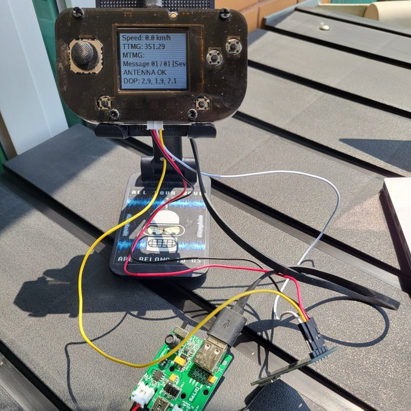
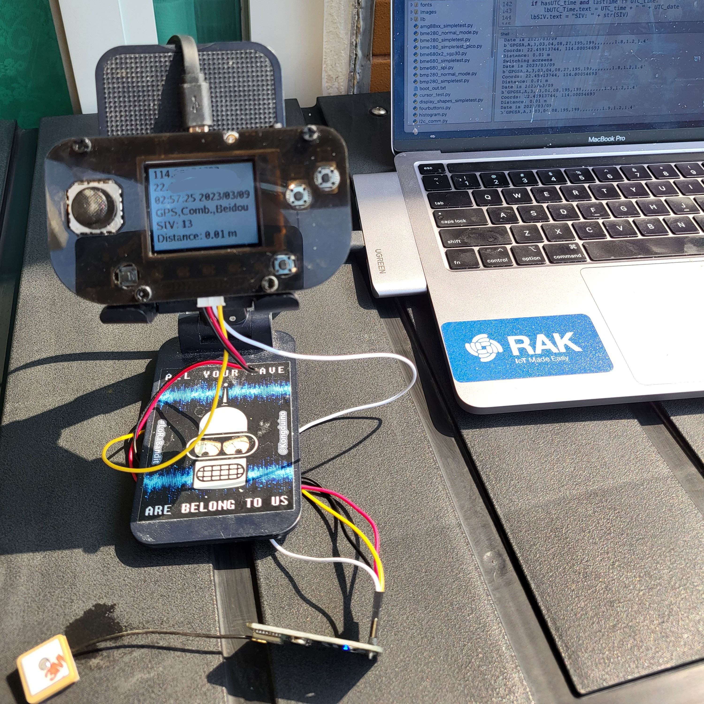

# PyGamer_NMEA_Parser

An NMEA sentences tokenizer and parser for the PyGamer. A GPS module is connected on the I2C Grove port. It requires fonts – I made my own with [FontForge](https://fontforge.org/en-US/) from fonts I have on my computer.

*Look Ma, no computer!*

*Trust but verify... ;-)*
